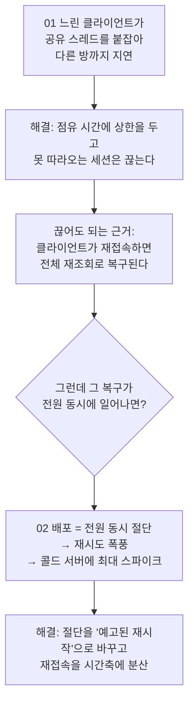
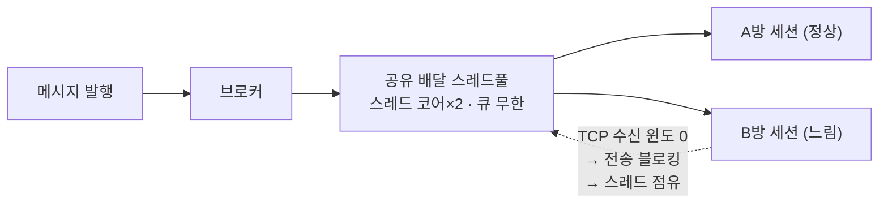
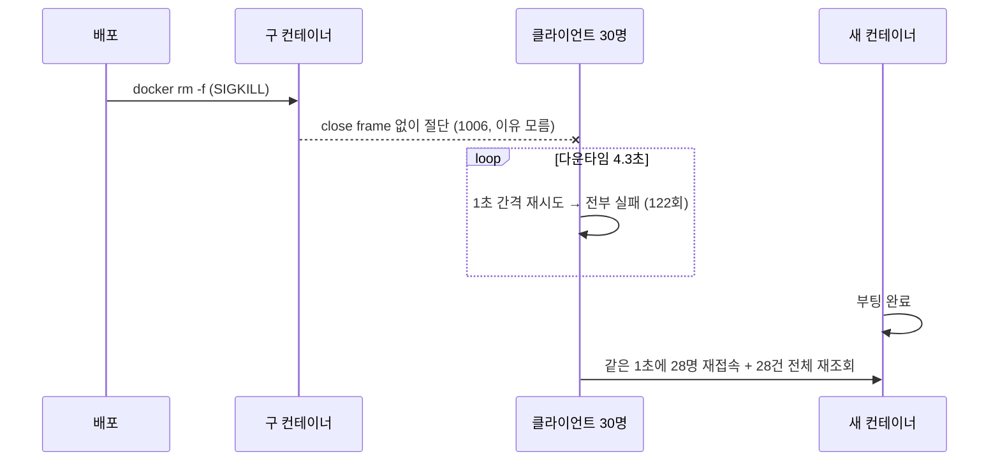

# SnapBook 백엔드 — 실시간 채팅 신뢰성 개선 기록

> **SnapBook**은 네일샵의 예약과 상담을 하나의 채팅방에서 처리하는 서비스입니다.
> 이 저장소는 그 채팅의 실시간성을 위협하던 문제 두 개를 **직접 찾아 재현하고, 고치고, 측정한 기록**입니다.
>
> 모든 수치는 실제 애플리케이션을 띄워 측정했고, **재현 코드와 원본 로그를 함께 담았습니다.**

`Java 17` · `Spring Boot 3.5.4` · `STOMP over WebSocket` · `MySQL 8.4` · `Docker` · `EC2`

---

## 30초 요약

| | 사용자가 겪는 문제 | 진짜 원인 | 개선 결과 (직접 측정) |
|---|---|---|---|
| **[01](docs/01-slow-consumer-blocking.md)** | **다른 방** 고객의 네트워크가 느리면 **내 방** 채팅이 3.4초 늦게 온다 | 브로드캐스트가 *모든 방이 공유하는* 스레드풀에서 실행된다. TCP 흐름제어 때문에 느린 소켓으로의 전송이 스레드를 붙잡으면, 무관한 방 메시지가 그 뒤에 줄을 선다 | 꼬리 지연 max **3,436ms → 1,427ms**<br>시간이 갈수록 악화되던 현상 **소멸** |
| **[02](docs/02-deploy-reconnect-storm.md)** | 배포할 때마다 전 사용자가 동시에 끊기고, 서버가 살아나는 순간 동시에 몰린다 | 배포 스크립트의 `docker rm -f`는 **SIGKILL**이라 정리 코드가 실행될 기회조차 없다. 게다가 전원이 같은 신호에 재시도해 스스로 부하를 만든다 | 재시도 폭풍 **122회 → 28회**<br>피크 동시 재접속 **28명/초 → 9명/초** |

두 사례 모두 **애플리케이션 코드가 아니라 그 아래 계층**(프레임워크 스레드 모델, TCP 흐름제어, 컨테이너 시그널)에서 벌어진 문제였습니다.

---

## 두 사례는 이어져 있습니다

01번을 고치면서 "**느린 세션은 끊어도 된다. 클라이언트가 재접속해서 다시 받아가니까**"라고 판단했습니다.
그런데 그 판단의 이면을 따라가 보니, **바로 그 복구 경로가 전원 동시에 발동하면 서버를 때리는 증폭기**가 됩니다. 그게 02번입니다.



같은 시스템을 두 번 보면서, **내가 내린 결정이 만든 새로운 실패 모드를 다시 추적한 기록**입니다.

---

## 01 — 다른 방의 느린 고객이 내 채팅을 3.4초 늦춘 문제

**[상세 문서 →](docs/01-slow-consumer-blocking.md)**

브로드캐스트 경로를 뜯어보니, 메시지 배달이 방마다 격리돼 있지 않았습니다.



측정하면서 **가설이 두 번 틀렸습니다.**

1. 읽기를 *완전히 멈춘* 클라이언트 → 증상 없음. 알고 보니 **테스트 클라이언트 쪽 버퍼(8KB)가 먼저 끊어서** 실험 자체가 성립하지 않았습니다. *(관측값이 0인 것과 문제가 없는 것은 다릅니다)*
2. 버퍼를 고치고 다시 → 여전히 증상 미미. **완전히 죽은 소비자는 서버 기본 보호(512KB)가 잘 끊어냅니다.**
3. 진짜 범인은 **찔끔찔끔 읽는(trickling) 소비자** — 보호 장치의 발동 조건을 비껴가며 스레드를 계속 붙잡습니다.

| 25초 측정 창 | 기준선 | 느린 구독자 24명 |
|---|---:|---:|
| p95 지연 | 3ms | **915ms** |
| max 지연 | 4ms | **3,436ms** |
| 느린 세션 생존 | – | **24/24** (기본 보호 미발동) |

p50은 0ms로 멀쩡합니다. **평균 그래프만 보면 존재하지 않는 장애**입니다.

**해결** — 세션이 배달 스레드를 붙잡을 수 있는 시간에 명시적 상한을 뒀습니다.

```java
// 1초 안에 128KB도 못 받아가는 세션은 채팅 UX상 이미 죽은 연결로 본다.
registry.setSendTimeLimit(1_000)
        .setSendBufferSizeLimit(128 * 1024);
```

max 지연이 `sendTimeLimit` 부근에서 잘리는 것(**3,436ms → 1,427ms**)이 원인을 제대로 짚었다는 증거입니다.

> **정직하게** — 이 수정은 문제를 없앤 게 아니라 *상한 없는 악화*를 *"최악이어도 1초"라는 계약*으로 바꿨습니다. 공유 풀 구조가 남아 있는 한 1초짜리 지연은 잔존하고, 완전한 제거는 외부 브로커로 전송을 격리해야 가능합니다.

---

## 02 — 배포할 때마다 일어나는 재접속 폭풍

**[상세 문서 →](docs/02-deploy-reconnect-storm.md)**

배포 스크립트는 `docker rm -f dev-app` 후 새 컨테이너를 띄우는 형태였습니다. 즉 **매 배포가 무통보 SIGKILL**입니다.

흥미로운 점은 `ENTRYPOINT`가 exec form이라 **JVM이 시그널을 받을 수 있는 상태였다**는 것입니다. 흔한 "shell form이 SIGTERM을 삼킨다" 문제가 아니라, **애초에 SIGTERM을 보내는 단계가 없었습니다.** 배관은 멀쩡한데 수도꼭지를 안 트는 상황이었습니다.



**세 층을 함께 고쳐야 했습니다.** 하나만 고치면 무효입니다 — SIGTERM이 없으면 앱의 정리 코드는 실행 기회조차 없습니다.

| 층 | 변경 |
|---|---|
| 배포 스크립트 | `docker rm -f` → `docker stop --time 30` (SIGTERM + 유예) |
| 애플리케이션 | `server.shutdown=graceful` + 종료 시 **가장 먼저** 전 세션에 `1012 Service Restart` close 전송 → 그 다음 HTTP 드레인 |
| 클라이언트 | "재시작" 신호를 받으면 즉시가 아니라 **0~8초 지터 후** 재접속 (+ 지수 백오프) |

| | 변경 전 | 변경 후 |
|---|---:|---:|
| 절단 신호 | `1006` (이유 없음 = 장애와 구분 불가) | `reason="server-restart"` |
| 재시도 폭풍 | 122회 | **28회** |
| 피크 동시 재접속 | 28명/초 | **9명/초** (4.5초에 분산) |
| 재조회 응답 p50 | 139ms | **9ms** |

**계획이 구현 디테일에 배신당한 지점도 기록했습니다** — 서버는 `1012`를 보냈는데 클라이언트는 `1002`로 받았습니다. RFC 6455 원 규격의 유효 코드가 1011까지라, 후속 등록된 1012를 클라이언트 스택이 프로토콜 위반으로 재해석한 것입니다. 그래서 신호를 **코드 하나에 걸지 않고 `code` + `reason` 문자열로 이중화**했습니다.

> **정직하게** — 다운타임 창(약 4초)은 그대로 남습니다. 단일 컨테이너를 교체하는 구조에서는 부팅 시간만큼의 정지를 없앨 수 없습니다. 이 개선은 *절단의 품질*과 *재접속 폭풍*을 고쳤고, 정지 창 제거는 블루-그린 배포의 몫입니다.

---

## 어떻게 측정했나

측정은 목업이 아니라 **실제 애플리케이션과 실제 배포 명령**으로 했습니다.

| 사례 | 측정 방식 |
|---|---|
| 01 | `@SpringBootTest`로 실제 WebSocket 설정·인증·브로커가 살아있는 서버를 띄우고, 정상 클라이언트 1명의 수신 지연을 재면서 다른 방에 느린 클라이언트 24명을 붙였습니다 |
| 02 | 실제 이미지를 도커로 띄우고 **배포 스크립트와 동일한 명령**(`docker rm -f` / `docker stop --time 30`)으로 죽이면서, 클라이언트 30명의 절단·재시도·재접속을 기록했습니다 |

두 하니스 모두 JUnit 태그로 기본 테스트 스위트에서 **분리**되어 있어(`./gradlew wsDemoTest`, `./gradlew deployStormTest`) 측정 코드가 CI를 느리게 만들지 않습니다.

> **이 저장소는 기록용입니다.** 하니스와 수정 코드는 서비스 저장소에서 발췌한 것이라 여기서 바로 빌드되지는 않습니다.
> 대신 **가공하지 않은 원본 로그와 집계 스크립트**를 넣어, 문서의 수치를 직접 검산하실 수 있게 했습니다.
>
> ```bash
> cd measurements && python3 aggregate.py before   # 개선 전 지표 재계산
> cd measurements && python3 aggregate.py after    # 개선 후 지표 재계산
> ```

- 측정 하니스 코드: [`harness/`](harness/) — 설계 의도와 실행 절차 포함
- 실제 서비스 코드와 변경분: [`code/`](code/) — 메시지가 흘러가는 경로 순서로 정리
- 가공하지 않은 원본 측정 로그: [`measurements/`](measurements/)

---

## 저장소 구조

```
docs/          두 사례의 상세 기록 (증상 → 증거 → 판단 → 해결 → 한계)
code/          실제 서비스 코드 — websocket / chat / deploy 경로별
               ├── websocket/  전송 경로와 종료 처리 (수정·신규 파일)
               ├── chat/       메시지 송수신과 복구 조회 경로
               ├── deploy/     Dockerfile, 배포 워크플로우, 종료 설정
               └── diffs/      설정 변경 diff
harness/       재현·측정용 테스트 코드 (설계 의도 포함)
measurements/  가공 전 원본 로그와 집계 스크립트
```

## 이 기록에서 보여드리고 싶은 것

- **증상이 아니라 메커니즘까지 내려갑니다.** "채팅이 느리다"에서 멈추지 않고, 어떤 스레드가 무엇 때문에 블로킹되는지까지 확인했습니다.
- **가설이 틀렸을 때 기록합니다.** 01번에서 두 번 재현에 실패했고, 그 실패가 위협 모델을 수정하게 했습니다.
- **측정 없는 개선은 하지 않습니다.** 모든 수치는 before/after를 같은 조건에서 직접 측정했습니다.
- **해결이 만든 새로운 비용도 적습니다.** 남은 한계와 다음 단계를 문서에 명시했습니다.
