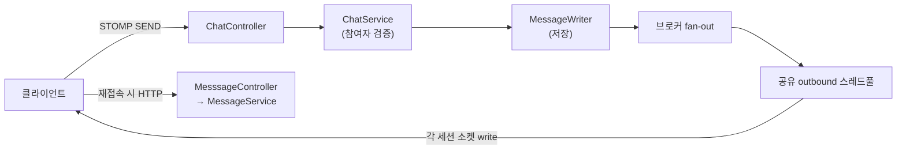

# 코드

두 사례와 직접 관련된 경로만 실제 서비스 코드에서 발췌했습니다. `★`는 이번에 **새로 만들거나 수정한** 파일입니다.

## 메시지 한 건이 흘러가는 길



`WebSocketConfig`가 이 그림에서 **`OUT` 구간의 정책**을 정하고, `WebSocketShutdownDrain`이 **종료 시 이 경로를 질서 있게 닫습니다.**

## `websocket/` — 실시간 전송 경로

| 파일 | 역할 | 사례 |
|---|---|---|
| `WebSocketConfig.java` ★ | 브로커·엔드포인트 설정. **전송 점유 한도**(01)와 **세션 추적 데코레이터**(02)를 여기서 붙였습니다 | 01, 02 |
| `WebSocketSessionRegistry.java` ★ | 살아있는 세션 목록. 계획된 종료 때 한 번에 닫기 위한 것 | 02 |
| `WebSocketShutdownDrain.java` ★ | `SmartLifecycle(phase=MAX)` — 종료 시 **가장 먼저** 전 세션에 `1012` close 전송 | 02 |
| `JwtChannelInterceptor.java` | STOMP `CONNECT` 프레임에서 JWT를 검증해 세션 principal을 세팅 | 배경 |
| `ChatTopicPublisher.java` | `convertAndSend`로 브로드캐스트하는 진입점. **이 한 줄이 공유 스레드풀로 들어갑니다** | 01 |

읽는 순서: `ChatTopicPublisher` → `WebSocketConfig` → `WebSocketShutdownDrain`

### 종료 순서가 왜 중요한가

```
SIGTERM 수신
 └─ 1. 웹소켓 세션에 1012 전송      ← WebSocketShutdownDrain (phase MAX_VALUE)
    2. 진행 중 HTTP 요청 드레인      ← server.shutdown=graceful
    3. 컨테이너 종료
```

`SmartLifecycle.stop()`은 phase가 큰 것부터 실행됩니다. 웹서버 graceful 단계보다 **먼저** 세션을 닫아야 클라이언트가 "재시작"을 알고 질서 있게 재접속할 수 있습니다.

세 층 중 하나만 고치면 무효라는 점이 핵심입니다 — **배포 스크립트가 SIGKILL을 보내면 위 코드는 실행 기회조차 없습니다.**

## `chat/` — 메시지 송수신과 복구 경로

01번의 핵심 판단이 "**느린 세션은 끊어도 된다 — 재접속하면 복구되니까**"였습니다. 그 주장의 근거가 되는 코드입니다.

| 파일 | 역할 |
|---|---|
| `ChatController.java` | `@MessageMapping` — STOMP로 들어온 메시지 수신 |
| `ChatService.java` | 채팅방 참여자 검증 (전송 권한) |
| `MessageWriter.java` | 메시지 저장 + 방 미리보기 포인터 갱신 |
| `MesssageController.java` | `GET /chat/rooms/{id}/messages` — **재접속 후 복구 조회 API** |
| `MessageService.java` / `MessageReader.java` | 커서 기반 조회, 읽음 포인터 전진 |
| `MessageRepository.java` | 조회 쿼리 |

> 파일명 `MesssageController`의 오타(`sss`)는 서비스 코드에 실재하는 것으로, 발췌 과정에서 임의로 고치지 않았습니다.

## `deploy/` — 배포 경로

| 파일 | 왜 중요한가 |
|---|---|
| `Dockerfile` | `ENTRYPOINT ["java", ...]` **exec form** — JVM이 PID 1로 시그널을 직접 받습니다. 즉 02번은 "shell form이 SIGTERM을 삼키는" 흔한 문제가 아니라, **애초에 SIGTERM을 보내는 단계가 없었던** 문제입니다 |
| `dev-deploy.yml` ★ | GitHub Actions 배포. `docker rm -f`(SIGKILL) → `docker stop --time 30`(SIGTERM + 유예)으로 변경 |
| `application.yml.excerpt` ★ | `server.shutdown: graceful`, `spring.lifecycle.timeout-per-shutdown-phase: 20s` |

## `diffs/` — 무엇이 바뀌었나

설정 변경은 전체 파일보다 diff가 읽기 쉬워 따로 두었습니다.

```
diffs/dev-deploy.yml.diff      배포 스크립트: SIGKILL → SIGTERM + 유예
diffs/application.yml.diff     graceful shutdown 활성화
```

## 참고

- 서비스 저장소에서 발췌한 파일이라 이 저장소만으로는 빌드되지 않습니다. 패키지 경로(`com.example.easybooking`)는 원본 그대로 유지했습니다.
- 측정에 쓴 하니스 코드는 [`../harness/`](../harness/)에 있습니다.
