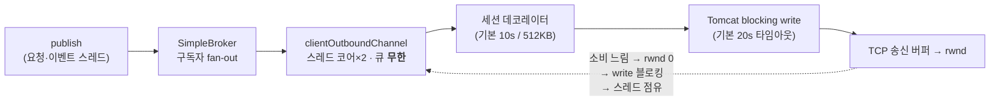

# 01 — 다른 방의 느린 고객이 내 채팅을 3.4초 늦춘 문제

> **한 줄 결론**
> STOMP 브로드캐스트는 모든 세션이 공유하는 스레드풀에서 실행된다. 읽기를 완전히 멈춘 소비자는 기본 보호(512KB 버퍼)에 걸려 금방 끊기지만, **찔끔찔끔 읽는 소비자는 그 보호를 비껴가며 스레드를 계속 점유한다.** 다른 방에서 그런 클라이언트 24명이 붙자 무관한 방의 채팅 지연이 4ms → 3,436ms로 치솟았고 시간이 갈수록 악화됐다. 세션의 스레드 점유 시간에 명시적 상한을 두어, *상한 없는 악화*를 *계약된 상한*으로 바꿨다.

| 항목 | 내용 |
|---|---|
| 난이도 | 상급 |
| 핵심 주제 | 브로드캐스트 스레드 토폴로지, TCP 흐름제어(rwnd), head-of-line blocking, 무한 큐, trickling consumer |
| 재현 | `./gradlew wsDemoTest` ([하니스 코드](../harness/SlowConsumerBroadcastDemoTest.java)) |

## 용어

| 용어 | 쉬운 뜻 |
|---|---|
| `clientOutboundChannel` | 서버 → 클라이언트 전송을 처리하는 **모든 세션이 공유**하는 스레드풀. 기본 코어 수 × 2, 큐는 무한 |
| rwnd (TCP 수신 윈도) | 수신자가 "이만큼만 보내라"고 알리는 값. 소비가 멈추면 0이 되어 송신 `write()`가 블로킹된다 |
| `sendTimeLimit` / `sendBufferSizeLimit` | 세션당 전송 보호 한도. **설정하지 않으면 10초 / 512KB** |
| trickling consumer | 죽지도, 제때 읽지도 않는 소비자. 버퍼 한도 보호를 비껴간다 |
| HOL blocking | 큐 앞의 느린 작업 하나가 뒤의 무관한 작업 전부를 막는 현상 |

## 지키려던 약속

채팅의 약속은 "내 방의 메시지는 즉시 온다"이고, 여기엔 **"다른 방 사정과 무관하게"** 가 암묵적으로 붙습니다.

그런데 이 서비스의 고객은 모바일입니다. 지하철, 엘리베이터, 화면 잠금, 약한 와이파이. **느린 소비자는 예외 상황이 아니라 일상 조건**입니다.

문제의 뿌리는 설정을 빠뜨린 게 아니라, **"이 배달 비용을 어떤 스레드가 내는지" 모른 채 기본값을 쓰고 있었다는 것**입니다.

## 브로드캐스트 경로 해부 — 누가 비용을 내는가



핵심은 fan-out된 전송 작업이 **방 구분 없이 하나의 풀**에 들어간다는 점입니다. 느린 세션으로의 write가 TCP에서 블로킹되면 그 스레드는 잠깁니다. 풀 크기(코어 10개 기준 20)를 넘는 느린 세션이 생기면, **무한 큐에 쌓이는 것은 다른 모든 방의 메시지**입니다.

## 증상에서 증거로 — 실험이 두 번 반증됐다

실제 애플리케이션 구성(WebSocket 설정 + 인증 인터셉터 + 브로커)을 그대로 띄우고, 정상 클라이언트 1명의 수신 지연을 타임라인으로 재면서 느린 클라이언트 24명을 다른 방에 붙였습니다.

**1차 — 읽기를 완전히 멈춘 소비자: 무증상.**
지연이 전혀 튀지 않았습니다. 파보니 서버가 아니라 **테스트 클라이언트 쪽 WebSocket 컨테이너의 기본 텍스트 버퍼(8KB)** 가 32KB 프레임에 먼저 반응해 연결을 끊고 있었습니다. 실험 자체가 성립하지 않은 것입니다.

> 여기서 배운 것: **관측값이 0인 것과 문제가 없는 것은 다릅니다.** 이후 하니스에 자기 검증 지표(`slowFrames`, `slowAlive`)를 넣어, "아무것도 안 잡힌 이유"를 구분할 수 있게 했습니다.

**2차 — 버퍼를 고치고 다시 완전 정지 소비자: 여전히 미미.**
완전히 멈춘 소비자는 서버의 512KB 버퍼 한도에 걸려 **빠르게 퇴출**됩니다. 기본 보호는 "죽은 소비자"를 잘 처리합니다.

**3차 — 프레임당 300ms씩 소비하는 trickling 소비자: 재현.**
보호 장치의 발동 조건을 비껴가는 건 **애매하게 느린** 소비자였습니다.

| 25초 측정 창 | 값 |
|---|---|
| 기준선 (방해 없음) | p95 3ms, max 4ms |
| 열화 (trickling 24명) | p50 0ms, **p95 915ms, max 3,436ms** |
| 타임라인 | 약 14초까지 정상(커널 버퍼가 흡수) → 스파이크 시작 → 후반부 1,412ms → 3,436ms **누적 악화** |
| 느린 세션 생존 | **24/24 전원 생존** (2,807프레임 수신) — 512KB 보호 미발동 |

p50은 멀쩡한데 p95/max만 폭발합니다. **평균 기반 모니터링으로는 보이지 않는 장애**입니다.

## 판단 과정

| 관찰 | 해석 | 선택 |
|---|---|---|
| 완전 정지 소비자는 재현 실패 | 기본 보호가 죽은 연결은 잘 끊는다 | 위협 모델을 "죽은 소비자"에서 **trickling**으로 수정 |
| trickling 24명에 무관한 방이 3.4초 지연, 갈수록 악화 | 공유 풀 포화 + 무한 큐 백로그. **상한이 없다** | 세션당 점유 창에 상한을 만든다 |
| 상한이 필요하지만 세션을 함부로 끊으면 메시지 유실 | 끊기의 안전성은 전송 계층이 아니라 **복구 경로**가 결정한다 | 재접속 시 전체 재조회로 복구되는 경로가 이미 있으므로 공격적 퇴출이 안전 |
| 한도를 줄여도 공유 풀 구조는 그대로 | 한도는 점유 창을 줄일 뿐 HOL 자체를 없애지 못한다 | 한도 명시를 1차 수정으로, 구조 분리는 다음 단계로 **구분해서 기록** |

## 해결

```java
@Override
public void configureWebSocketTransport(WebSocketTransportRegistration registry) {
    // 브로드캐스트는 공유 clientOutboundChannel 스레드풀에서 실행되므로,
    // 천천히 읽는 세션 하나가 스레드를 오래 붙잡으면 다른 모든 방의 전송이 그 뒤에 줄을 선다.
    // 기본값(sendTimeLimit 10초, 버퍼 512KB)은 그 점유 창을 너무 길게 허용한다.
    // 1초 안에 128KB를 못 받아가는 세션은 채팅 UX상 이미 죽은 연결로 보고 끊는다.
    // 끊어도 안전한 근거: 클라이언트는 재접속 시 목록 전체 재조회로 복구한다.
    registry.setSendTimeLimit(1_000)
            .setSendBufferSizeLimit(128 * 1024);
}
```

수정 자체는 두 줄입니다. **진짜 판단은 "끊어도 되는 근거"** 쪽에 있었습니다.

세션을 공격적으로 끊으면 그 순간의 메시지는 유실됩니다. 그런데 이 서비스에는 이미 재접속 시 목록을 다시 받아오는 복구 경로가 있습니다. 즉:

> 끊기의 안전성은 전송 계층이 아니라 **복구 경로의 존재**가 결정한다.

## 검증

| 동일 시나리오 | 기본값 | 한도 명시 후 |
|---|---:|---:|
| 정상 방 p95 | 915ms | **255ms** |
| 정상 방 max | 3,436ms | **1,427ms** (≈ `sendTimeLimit` 상한) |
| 후반부 누적 악화 | 3,436 → 2,934ms 지속 | **소멸** — 스파이크 후 1초 내 회복 |
| 느린 세션 퇴출 | 0/24 | 13/24 |

max가 `sendTimeLimit` 부근에서 잘리는 것 자체가 메커니즘을 제대로 짚었다는 증거입니다. 이 수정은 지연을 없앤 게 아니라 **최악 점유 시간에 계약된 상한**을 만들었습니다.

## 이 해결이 만든 새로운 비용

- 진짜 느린 네트워크의 정상 사용자도 끊길 수 있습니다. 복구 경로가 있어 데이터는 안전하지만 재연결 비용을 냅니다 — 한도 값은 실사용 환경의 rwnd 분포를 계측해 조정해야 합니다.
- 공유 풀인 한 **상한(약 1초) 내의 HOL은 남습니다.** 구조적 제거는 외부 브로커 릴레이로 세션별 전송을 격리해야 가능하고, 이는 수평 확장 요구와 함께 갈 다음 단계입니다.
- 실험은 32KB 페이로드로 과장 재현했습니다. 실제 메시지는 더 작지만, 예약 상태 카드가 스냅샷 컬럼을 그대로 직렬화하므로 **payload 다이어트가 같은 문제의 다른 절반**입니다.

## 실측 사실과 추론 구분

| 구분 | 내용 |
|---|---|
| 실측 사실 | 위 표의 지연·생존 수치, 타임라인, 1차 실험이 클라이언트 버퍼 때문에 무효였던 것 — 모두 실제 앱 구성 기반 하니스의 재현 결과 |
| 실측 사실 | 기본 한도(10초 / 512KB, Tomcat 20초)와 outbound 풀 크기(코어×2)는 프레임워크 코드에서 확인한 값 |
| 추론 | 로컬 루프백은 실제 모바일보다 버퍼가 관대하다 — 운영 환경(느린 무선망, 작은 rwnd)에서는 **더 적은 클라이언트로 더 쉽게** 발생할 것 |
| 확인 필요 | 운영에서 세션별 송신 지연·퇴출 횟수 계측이 아직 없다. 한도 값을 데이터로 조정하려면 이 지표 노출이 선행돼야 함 |

## 예상 질문

**Q. 완전히 멈춘 클라이언트보다 천천히 읽는 클라이언트가 더 위험했던 이유는?**
버퍼 한도 보호는 "버퍼가 가득 찼는가"로 발동합니다. 완전 정지는 버퍼를 빠르게 채워 스스로 퇴출을 유발하지만, 트리클링은 버퍼를 아슬아슬하게 비우며 발동 조건을 계속 회피합니다. 보호 장치를 우회하는 입력이 가장 위험합니다.

**Q. 세션을 공격적으로 끊는 게 왜 안전한가?**
전송 계층의 결정이 아니라 복구 경로의 존재가 안전성을 결정합니다. 재접속 시 전체 재조회로 상태가 복원되기 때문에, 끊는 비용이 "재연결 한 번"으로 제한됩니다.

**Q. 이 수정으로 문제가 해결됐나?**
아닙니다. *상한 없는 악화*를 *계약된 상한*으로 바꿨습니다. 공유 풀 구조가 남긴 HOL은 브로커 릴레이로 전송을 격리해야 사라집니다. 그건 수평 확장을 할 때 함께 할 작업으로 남겨두었습니다.

---

← [README로 돌아가기](../README.md) · [다음 사례: 배포 재접속 폭풍 →](02-deploy-reconnect-storm.md)
