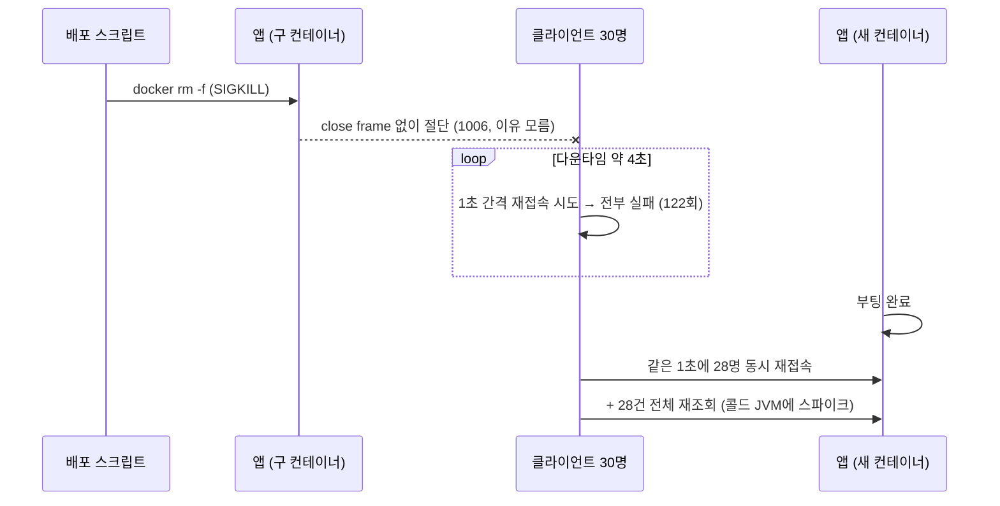

# 02 — 배포할 때마다 일어나는 재접속 폭풍

> **한 줄 결론**
> 배포 스크립트의 `docker rm -f`는 SIGKILL이라 **매 배포가 "계획된 장애"** 였다. 30개 웹소켓이 이유 없는 절단(1006)으로 동시에 끊기고, 다운타임 동안 122회의 재시도 폭풍이 일고, 서버가 부활한 1초 안에 28명이 동시에 재접속 + 전체 재조회를 때렸다. SIGTERM 경로로 바꾸고 종료 순서를 계약화하고 클라이언트 재시도에 지터를 넣어, 재시도 폭풍 122 → 28회, 피크 동시 재접속 28 → 9명/초로 눌렀다. 다운타임 창 자체는 단일 인스턴스 구조의 한계로 남는다 — 이 개선의 스코프 밖임을 명시한다.

| 항목 | 내용 |
|---|---|
| 난이도 | 상급 |
| 핵심 주제 | SIGKILL vs SIGTERM, 컨테이너 종료 수명주기, WebSocket close code(1012), graceful shutdown 순서, thundering herd |
| 재현 | `DEMO_MODE=naive\|jitter ./gradlew deployStormTest` ([하니스 코드](../harness/DeployStormClientDemoTest.java)) |

## 용어

| 용어 | 쉬운 뜻 |
|---|---|
| SIGTERM / SIGKILL | "정리하고 종료해라"(잡을 수 있음) / "즉사"(잡을 수 없음). `docker stop`은 TERM 후 유예, `docker rm -f`는 사실상 KILL |
| exec form | `ENTRYPOINT ["java", ...]` — java가 PID 1이 되어 시그널을 직접 받는 형태 |
| close code 1012 | RFC 6455 후속 등록 "Service Restart". `1006`은 "close frame 없이 끊김"(비정상) |
| graceful shutdown | 새 요청은 거부하되 진행 중 요청은 완료 후 종료 |
| thundering herd | 같은 신호에 대기하던 다수가 동시에 몰려드는 현상 |

## 지키려던 약속과 발견

develop에 push할 때마다 EC2에서 `docker rm -f dev-app` 후 새 컨테이너를 띄웁니다. 즉 **배포 = 무통보 SIGKILL**입니다. 파이프라인을 뜯어보니:

- `rm -f`는 SIGKILL — 진행 중 트랜잭션도, 웹소켓도 그 밀리초에 끝납니다.
- **반전**: `ENTRYPOINT`가 exec form이라 **java가 PID 1로 시그널을 받을 수 있는 상태였습니다.** 흔한 "shell form이 SIGTERM을 삼킨다" 버그가 아니라, 애초에 SIGTERM을 보내는 단계가 없었습니다. 배관은 멀쩡한데 수도꼭지를 안 트는 격입니다.
- `server.shutdown` 미설정(기본 immediate), `HEALTHCHECK`는 있지만 아무것도 게이트하지 않음(로드밸런서 없는 8080 직결), 이미지 태그가 `latest` 단일이라 롤백 경로도 없음.

채팅 서비스라 피해의 중심은 HTTP가 아니라 **웹소켓**입니다. 전 클라이언트가 같은 순간 절단되고, 이 서비스의 복구 설계(재접속 + 전체 재조회)가 **전원 동시에** 발동합니다.

> [01번 사례](01-slow-consumer-blocking.md)에서 "복구 경로가 있으니 공격적으로 끊어도 안전하다"고 결론냈습니다.
> 이 사례는 그 이면입니다 — **그 복구 경로가 동시에 터지면 증폭기가 됩니다.**

## 변경 전 실패 경로



## 증상에서 증거로

실제 이미지를 로컬 도커로 띄우고(배포 스크립트와 동일한 `run` 명령), STOMP 클라이언트 30개(끊기면 1초 간격 재접속 + 재접속 즉시 전체 재조회)와 50ms 간격 HTTP 프로버를 붙인 뒤, **실제 스크립트 그대로** `rm -f` → `run`을 실행했습니다.

| 변경 전 (`rm -f`) 실측 | 값 |
|---|---|
| 절단 | 30명 전원 T+0.11초 **동시**, close code **1006** (reason 없음 — 장애인지 배포인지 구분 불가) |
| 다운타임 창 | **4.31초** (실패 프로브 60건) |
| 재시도 폭풍 | 다운타임 중 실패한 접속 시도 **122회** |
| 부활 순간 | **1초 안에 28/30명 재접속 + 28건 전체 재조회**, 재조회 p50 **139ms** |

클라이언트 30명 기준입니다. **클라이언트 수에 비례해 커지는 구조**이고, 콜드 JVM(빈 커넥션 풀, JIT 전)이 받는 첫 부하가 하필 최대 스파이크입니다.

## 판단 과정

| 관찰 | 해석 | 선택 |
|---|---|---|
| 1006 절단 — 클라이언트가 이유를 모름 | 장애와 배포를 구분 못 하니 클라이언트 정책도 나눌 수 없다 | 계획된 종료엔 **1012 + reason**으로 "재시작"을 명시 |
| exec form이라 시그널 배관은 정상 | 문제는 앱이 아니라 **스크립트가 KILL을 보내는 것** | `docker stop --time 30`으로 SIGTERM 경로 활성화 |
| 절단보다 부활 순간이 더 위험 (28명/초 + 재조회) | 폭풍의 뿌리는 서버가 아니라 **클라이언트 재시도 정책의 동기화** | 클라이언트에 0~8초 지터 + 지수 백오프 |
| 다운타임 창 4.3초는 stop으로 바꿔도 남음 | 단일 인스턴스 스왑의 구조적 한계 | 이 개선의 **스코프 밖으로 명시**, 블루-그린은 다음 수 |
| (실측 중 발견) 서버가 1012를 보냈는데 클라이언트는 **1002**로 보고 | RFC 6455 원 규격 유효 코드는 1011까지 — 1012는 후속 등록이라 클라이언트 스택이 프로토콜 위반으로 재해석. **reason 문자열은 보존됨** | 신호를 코드 하나에 걸지 않고 **code + reason 이중화** |

## 해결 — 종료 순서를 계약으로

**세 층을 함께 고쳐야 합니다.** 하나만 고치면 효과가 없습니다 — SIGTERM 없이는 앱 코드가 실행 기회조차 없습니다.

**① 배포 스크립트** — SIGTERM + 유예

```yaml
# rm -f(SIGKILL)는 진행 중 요청과 웹소켓을 즉사시킨다.
# SIGTERM + 30초 유예로 앱의 graceful shutdown이 실행되게 한다.
docker stop --time 30 dev-app || true
docker rm dev-app || true
docker run -d --name dev-app ...
```

**② 애플리케이션** — 종료 순서 계약

```yaml
server:
  shutdown: graceful          # 진행 중 HTTP 요청 드레인
spring:
  lifecycle:
    timeout-per-shutdown-phase: 20s
```

```java
/**
 * 종료 순서 계약:
 *   1. (이 컴포넌트, 가장 먼저) 모든 웹소켓 세션에 1012 SERVICE_RESTART close 전송
 *      → 클라이언트는 "재시작"임을 알고 지터를 둔 재접속 + 재조회로 복구한다.
 *   2. server.shutdown=graceful 이 진행 중 HTTP 요청을 드레인
 *   3. 컨테이너 종료
 */
@Component
public class WebSocketShutdownDrain implements SmartLifecycle {

    static final CloseStatus SERVICE_RESTART = new CloseStatus(1012, "server-restart");

    @Override
    public void stop() {
        int closed = sessionRegistry.closeAll(SERVICE_RESTART);
        log.info("계획된 종료: 웹소켓 세션 {}개 중 {}개에 1012(SERVICE_RESTART) 전송", total, closed);
    }

    @Override
    public int getPhase() {
        return Integer.MAX_VALUE;   // 종료 시 웹서버 graceful 단계보다 먼저 실행
    }
}
```

`SmartLifecycle`의 `stop`은 phase가 큰 것부터 실행되므로, 웹서버 graceful 단계보다 **먼저** 실행되게 최대 phase를 사용했습니다.

**③ 클라이언트** — 재시도를 시간축에 분산

"재시작" 신호를 받으면 즉시 재접속하지 않고 0~8초 지터 후 재접속하고, 연속 실패에는 지수 백오프(상한 8초, ±25%)를 적용합니다.

→ 전체 코드: [`WebSocketShutdownDrain.java`](../code/websocket/WebSocketShutdownDrain.java) · [`WebSocketSessionRegistry.java`](../code/websocket/WebSocketSessionRegistry.java) · [`dev-deploy.yml`](../code/deploy/dev-deploy.yml) · [`Dockerfile`](../code/deploy/Dockerfile)

**실행 증거** (서버 로그):

```
계획된 종료: 웹소켓 세션 31개 중 31개에 1012(SERVICE_RESTART) 전송
```

## 검증 (동일 시나리오 재실행)

| 지표 | `rm -f` + 즉시 재시도 | `stop` + graceful + 지터 |
|---|---:|---:|
| 절단 신호 | `1006`, reason 없음 | **reason="server-restart"** (코드는 클라이언트가 1002로 재해석) |
| 재시도 폭풍 (다운타임 중) | 122회 | **28회 (−77%)** |
| 피크 동시 재접속 | 28명/초 | **9명/초**, T+4~8.5초에 분산 |
| 재조회 스파이크 | 28건/초, p50 139ms | 최대 9건/초, **p50 9ms** |
| 다운타임 창 | 4.31초 | 3.83초 (대동소이 — 예상대로 구조적 한계) |

## 이 해결이 만든 새로운 비용

- **다운타임 창은 그대로입니다.** 단일 컨테이너 스왑인 한 부팅 시간만큼의 정지는 없앨 수 없습니다. 정직하게: 이 개선은 절단 품질과 재접속 폭풍을 고쳤고, 정지 창은 블루-그린 배포 없이는 못 고칩니다.
- 30초 유예만큼 배포가 느려집니다. 드레인할 작업이 없으면 즉시 종료되므로 실제 비용은 진행 중 작업량에 비례합니다.
- **1012는 스택에 따라 재해석됩니다**(실측). 브라우저·SockJS 경유 시 클라이언트가 받는 코드를 실기기에서 확인해야 하고, 그래서 reason 문자열이 이중 안전장치입니다.
- 지터는 프론트엔드가 구현해야 완성됩니다 — 서버 혼자서는 폭풍을 막을 수 없습니다. 하니스로 정책 효과는 검증했지만 실제 클라이언트 반영은 별도 작업입니다.

## 실측 사실과 추론 구분

| 구분 | 내용 |
|---|---|
| 실측 사실 | 위 표의 모든 수치, 1006 / 1002+reason 관측, 드레인 로그 — 실제 이미지·실제 배포 명령 기반 재현 결과 ([원본 로그](../measurements/)) |
| 실측 사실 | 서버는 1012를 보냈고(서버 로그) 클라이언트는 1002+reason으로 보고했다(관측자 로그) — 클라이언트 스택의 코드 검증 때문 |
| 추론 | 로컬 부팅 4~5초는 개발 머신 기준 — EC2에서는 다운타임 창이 더 길 것. 클라이언트 수가 늘면 폭풍은 비례해 커짐 |
| 확인 필요 | 실제 프론트엔드의 재접속 정책(현재 가정: 즉시 재시도), 도메인 앞단의 프록시·TLS 종단 구조, 브라우저에서의 1012 수신 여부 |

## 예상 질문

**Q. `docker rm -f`와 `docker stop`의 차이가 애플리케이션에 왜 중요한가?**
SIGKILL은 프로세스가 잡을 수 없습니다. `server.shutdown=graceful`을 켜두고 종료 훅을 아무리 잘 만들어도, KILL을 받으면 그 코드는 실행 기회 자체가 없습니다. exec form으로 시그널 배관이 멀쩡해도 마찬가지입니다.

**Q. 절단보다 재접속이 더 위험했던 이유는?**
전원이 같은 신호에 동기화되어 콜드 서버(빈 커넥션 풀, JIT 전)에 최대 스파이크가 몰립니다. 복구 경로가 증폭기로 뒤집히는 구조입니다.

**Q. 1012를 보냈는데 클라이언트가 1002를 받았다. 어떻게 대응했나?**
실측으로 스택별 코드 재해석을 확인하고, 신호를 `code` + `reason`으로 이중화했습니다. 실기기 검증은 "확인 필요"로 남겨두었습니다. 규격 문서만 믿지 않고 실제로 받아본 값으로 판단한 부분입니다.

**Q. 이걸로 무중단 배포가 됐나?**
아닙니다. 절단 품질과 폭풍만 고쳤습니다. 정지 창 제거는 블루-그린 또는 로드밸런서의 몫이고, 그건 다음 단계입니다.

---

← [이전 사례: 느린 소비자 블로킹](01-slow-consumer-blocking.md) · [README로 돌아가기](../README.md)
